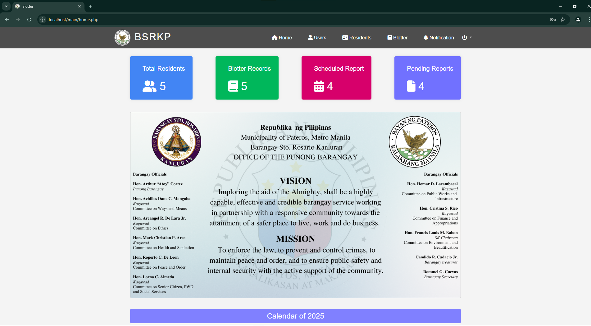

# Blotter System

The Blotter System Web Application is developed as a requirement for the `System Analysis and Design` subject. This project is aimed at providing an efficient and user-friendly solution for managing and tracking blotter records. The system is designed to serve as an information management tool, streamlining the process of recording, updating, and retrieving blotter details.

This application is being developed in collaboration with [Sto. Rosario Kanluran Pateros](https://www.google.com/maps/place/68m.lozAda+Sto.+Rosario+Kanluran+Barangay+Hall/@14.5526269,121.0662068,17z/data=!3m1!4b1!4m6!3m5!1s0x3397c8862217a9d9:0x92e8df6972942ee9!8m2!3d14.5526269!4d121.0687817!16s%2Fg%2F11bzvtrrfh?entry=ttu&g_ep=EgoyMDI1MDEwOC4wIKXMDSoASAFQAw%3D%3D)' blotter officer, who is responsible for managing blotter reports. Acting as the primary source of information and requirements, the blotter officer provides essential data and insights based on their traditional incident management practices and other core functionalities. This collaboration ensures the system aligns with actual operational needs and improves efficiency.

⚠️ **Note:** This project is still under development, it may behave weird functionality on some modules. And I'm still working on interface design since this project was rushed

